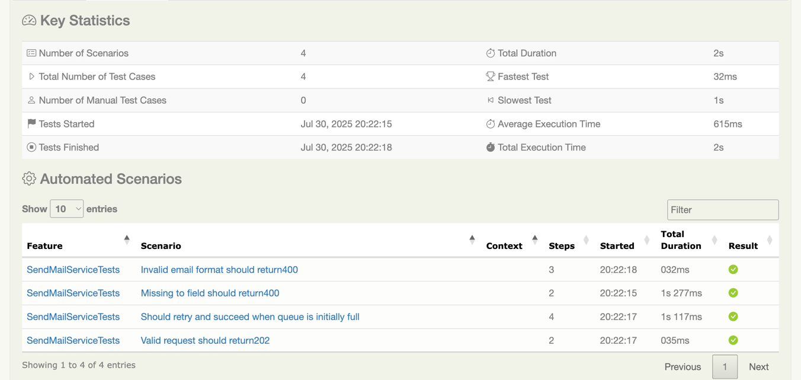
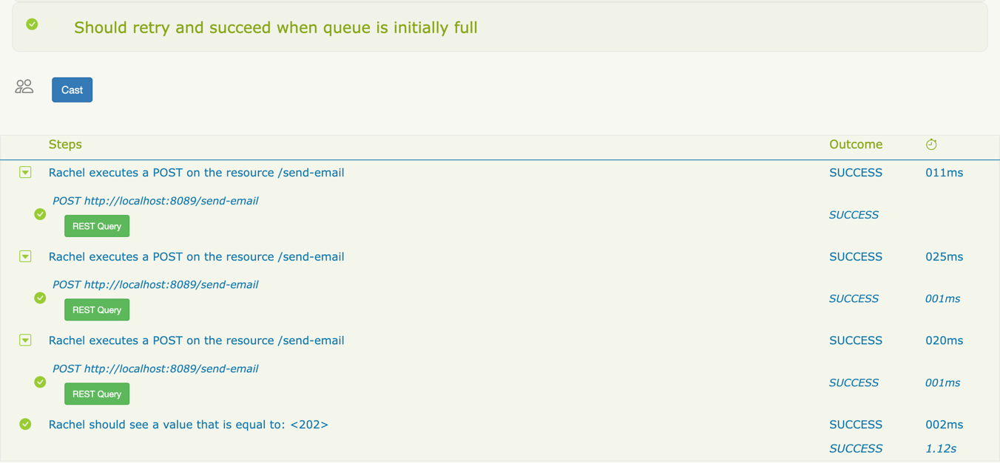
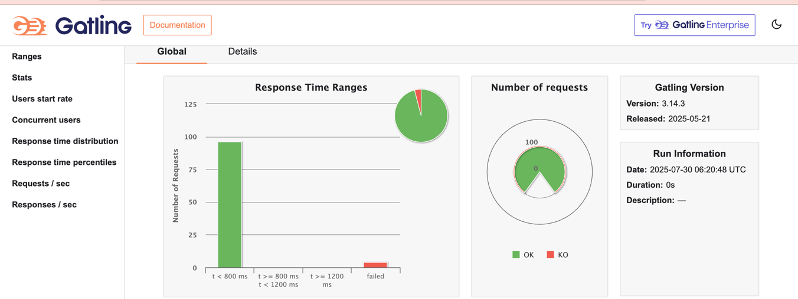

# 📧 Send Email Service Test automation & Load Testing

This project tests the `/send-email` API using:

* ✅ **Serenity BDD + Screenplay + JUnit 5** for Functional API Tests
* 🚀 **Gatling** for Load Testing
* 🧪 **WireMock** to simulate the backend SMTP/email service

---

## 📁 Project Structure

```
.
├── src
│   └── test
│       └── java
│           ├── dev.ple
│           │   └── SendMailServiceTests.java         # Functional tests with WireMock
│           └── dev.ple.gatling
│               └── EmailLoadSimulation.java          # Load test simulation with Gatling
```

---

## ⚙️ Tech Stack

| Tool         | Purpose                                  |
| ------------ | ---------------------------------------- |
| Serenity BDD | API Testing Framework (Screenplay Style) |
| JUnit 5      | Test Runner                              |
| WireMock     | Mocking Email Service                    |
| Gatling      | Load Testing                             |
| Java 17+     | Programming Language                     |
| Maven        | Build Tool                               |

---

## ✅ Functional Tests (`SendMailServiceTests`)

### 📌 Tested Scenarios

| Scenario               | Description                                         | Expected |
| ---------------------- | --------------------------------------------------- | -------- |
| ✅ Valid Request        | Sends well-formed JSON with `to`, `subject`, `body` | 202      |
| ❌ Missing `"to"` Field | Omits required recipient address                    | 422      |
| ❌ Invalid Email Format | Sends malformed email address                       | 422      |
| 🔄 Retry Scenario      | First 2 attempts fail (503), 3rd attempt succeeds   | 202      |

### 🔄 Retry Test Logic

* The `@Tag("Retry")` test simulates:

    * First request → 503 (Queue full)
    * Second request → 503
    * Third request → 202 (Success)

---

## 🦪 How to Run Functional Tests

Make sure **port `8089` is free** (used by WireMock).

Run all tests:

```bash
mvn clean verify
```
---
## Serenity Report - Test execution snapshots






## 🚀 Load Testing with Gatling

### 💡 Scenario

Simulates **100 concurrent users** sending a POST request to `/send-email`.

### 🔧 Running the Load Test

```bash
mvn gatling:test
```

### 📈 View the Results

After the run, open:

```
target/gatling/emailloadtest-<timestamp>/index.html
```

This report includes:

* Response time distributions
* Number of requests per second
* Success/failure rate



---

## 📦 Maven Dependencies

Ensure your `pom.xml` includes:

```xml
<dependencies>
    <!-- Serenity Core -->
    <dependency>
        <groupId>net.serenity-bdd</groupId>
        <artifactId>serenity-core</artifactId>
        <version>4.1.12</version>
    </dependency>

    <!-- Serenity Screenplay + REST -->
    <dependency>
        <groupId>net.serenity-bdd</groupId>
        <artifactId>serenity-screenplay-rest</artifactId>
        <version>4.1.12</version>
    </dependency>

    <!-- Serenity JUnit5 Integration -->
    <dependency>
        <groupId>net.serenity-bdd</groupId>
        <artifactId>serenity-junit5</artifactId>
        <version>4.1.12</version>
    </dependency>

    <!-- WireMock for Mock Server -->
    <dependency>
        <groupId>com.github.tomakehurst</groupId>
        <artifactId>wiremock-jre8</artifactId>
        <version>2.35.0</version>
        <scope>test</scope>
    </dependency>

    <!-- Gatling Dependencies -->
    <dependency>
        <groupId>io.gatling</groupId>
        <artifactId>gatling-app</artifactId>
        <version>3.10.5</version>
        <scope>test</scope>
    </dependency>
</dependencies>
```

---

## 🚓 Cleanup Notes

* WireMock is started/stopped automatically in tests.
* Gatling automatically shuts down after load simulation.
* Ensure **port 8089** is available and not blocked by another process.

---

## 👤 Author

**Paul LEUFANG**  
Software Engineer | Automation Specialist  
📧 [[paulleufang@gmail.com](mailto:paulleufang@gmail.com)]  
🔗 [LinkedIn](https://www.linkedin.com/in/paul-leufang-b4a462168/)

